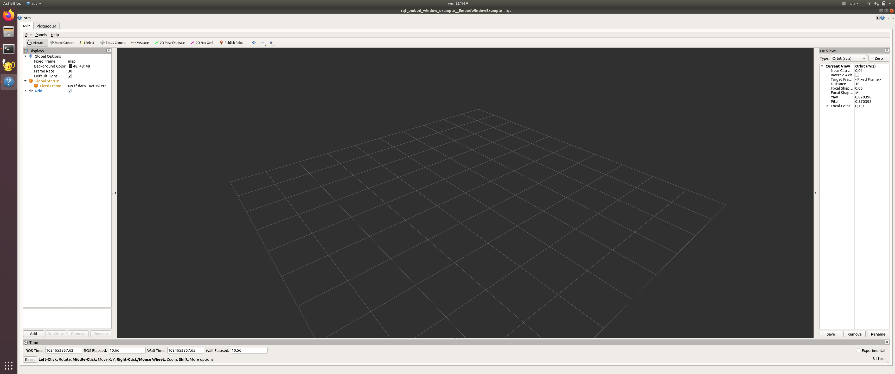

# `rqt_embed_window_example`: Example of embedding `rqt_embed_window` widget into different tabs of a custom GUI

Author: [Tobit Flatscher](https://github.com/2b-t)

Small example of how the `rqt_embed_window` widget can be embedded into your custom GUI.

1) [Create a new ROS workspace](http://wiki.ros.org/catkin/Tutorials/create_a_workspace) 

2) Inside the `src` folder **insert this package as well as the `rqt_embed_window` module** with `QWidget`:

```bash
$ git clone https://github.com/2b-t/rqt_embed_window
$ git clone https://github.com/2b-t/rqt_embed_window_example
```

3) Install **[plotjuggler](https://github.com/facontidavide/PlotJuggler)**

```bash
$ sudo apt install ros-<distro>-plotjuggler-ros
```

where `<distro>` corresponds to your ROS distro (e.g. melodic).

4) Open a new console inside your workspace, source your workspace

```
$ source devel/setup.bash
```

and build it

```bash
$ catkin build
```

5) Open a new console, source the workspace again and start your ROS master

```bash
$ roscore
```

6) Launch the `rqt` GUI example in standalone mode

```bash
$ rqt --standalone rqt_embed_window_example --force-discover
```



